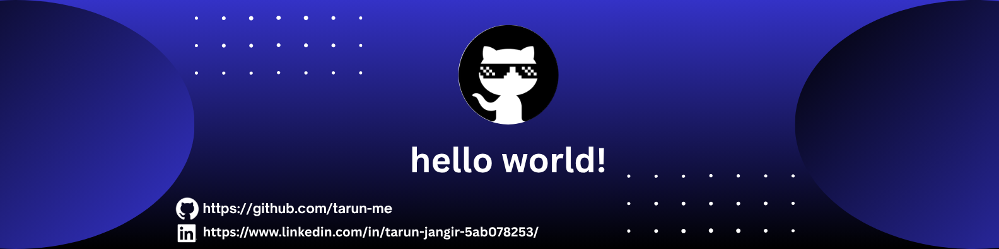

<!--Banner-->

​<!--Night Owl image-->

​<!--Header Name-->
​ɪ'ᴍ TARUN!

​Aspiring Software Developer | CS Student
 
​<!--Start Intro-->

I am a beginner Computer Science student currently learning programming from the ground up. I am exploring various technologies, including Java, C++, HTML, XML, CSS, JavaScript, PHP, and SQL. My main interests are in web development, software engineering, and databases.

​✨ Passionate about learning and growing as a developer.
​🌱 Currently improving my understanding of programming fundamentals.
​💻 Exploring different programming languages and problem-solving techniques.
​✍ Interested in open-source contributions and real-world projects.
​🚀 Excited to apply my knowledge and build new things step by step.
​📜 Looking to connect and collaborate with other learners!
​<!--Profile Count Badge-->

​<!--Languages and Tools Section-->
<h2 align="center">💻 Tᴇᴄʜ Sᴛᴀᴄᴋ & Cᴜʀʀᴇɴᴛ Lᴇᴀʀɴɪɴɢ 💻</h2>
​

<picture>
<source media="(prefers-color-scheme: dark)" srcset="./Skills_Animation_Dark.gif">
<source media="(prefers-color-scheme: light)" srcset="./Skills_Animation_White.gif">

</picture>

 

​📚 Current Learning 

​Learning the basics of programming and software development.
​Exploring C++, PHP, Java, and web technologies step by step.
​Practicing problem-solving and improving coding logic.

​🎯 Goals

​Gain confidence in coding and build simple projects.
​Understand web development and backend technologies.
​Keep learning and improving through practice.
​<!--Github stats Section-->
<h2 align="center">📊 GɪᴛHᴜʙ Sᴛᴀᴛs 📊</h2>
​

​

​<!--Contribution Graph-->
<h2 align="center">📈 Cᴏɴᴛʀɪʙᴜᴛɪᴏɴ Gʀᴀᴘʜ 📈</h2>

<h2 align="center">🐍 Mʏ Cᴏɴᴛʀɪʙᴜᴛɪᴏɴ Sɴᴀᴋᴇ 🐍</h2>

  <picture>
    <source media="(prefers-color-scheme: dark)" srcset="https://raw.githubusercontent.com/tarun-me/tarun-me/output/github-snake-dark.svg">
    <source media="(prefers-color-scheme: light)" srcset="https://raw.githubusercontent.com/tarun-me/tarun-me/output/github-snake.svg">
    
  </picture>

​<!--Dynamic Quote Cards-->
<h2 align="center">🌟 Tʜᴏᴜɢʜᴛ ᴏғ ᴛʜᴇ Dᴀʏ 🌟</h2>

​<!--Contact Section--> 
<h2 align="center">🤝 Cᴏɴɴᴇᴄᴛ Wɪᴛʜ Mᴇ 🤝 </h2>

  

<a href="https://www.github.com/tarun-me" target="_blank">
  <picture>
    <source media="(prefers-color-scheme: dark)" srcset="./github_White.png">
    <source media="(prefers-color-scheme: light)" srcset="./github_dark.png">    
    
  </picture>
</a>

 
​<!--Buy me a coffee / Telegram-->

​<!--Footer-->

