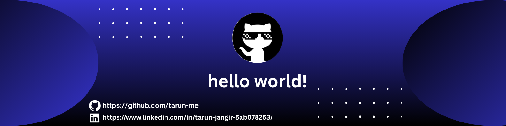

 <h1>
   ɪ'ᴍ TARUN!
</h1>

Aspiring Software Developer | CS Student

I am a beginner Computer Science student currently learning programming from the ground up. I am exploring various technologies, including Java, C++, HTML, XML, CSS, JavaScript, PHP, and SQL. My main interests are in web development, software engineering, and databases.

✨ Passionate about learning and growing as a developer.
🌱 Currently improving my understanding of programming fundamentals.
💻 Exploring different programming languages and problem-solving techniques.
✍ Interested in open-source contributions and real-world projects.
🚀 Excited to apply my knowledge and build new things step by step.
📜 Looking to connect and collaborate with other learners!

<h2 align="center">💻 Tᴇᴄʜ Sᴛᴀᴄᴋ & Cᴜʀʀᴇɴᴛ Lᴇᴀʀɴɪɴɢ 💻</h2>

<table>
  <tr>
    <td width="50%" valign="top">
      <h3>📚 Current Learning</h3>
      <ul>
        <li>Learning the basics of programming and software development.</li>
        <li>Exploring C++, PHP, Java, and web technologies step by step.</li>
        <li>Practicing problem-solving and improving coding logic.</li>
      </ul>
       
      <h3>🎯 Goals</h3>
      <ul>
        <li>Gain confidence in coding and build simple projects.</li>
        <li>Understand web development and backend technologies.</li>
        <li>Keep learning and improving through practice.</li>
      </ul>
    </td>
    <td width="50%" valign="top" align="center">
      
    </td>
  </tr>
</table>
    
<h2 align="center">📊 GɪᴛHᴜʙ Sᴛᴀᴛs 📊</h2>

<h2 align="center">🐍 Mʏ Cᴏɴᴛʀɪʙᴜᴛɪᴏɴ Sɴᴀᴋᴇ 🐍</h2>

  <picture>
    <source media="(prefers-color-scheme: dark)" srcset="https://raw.githubusercontent.com/tarun-me/tarun-me/output/github-snake-dark.svg">
    <source media="(prefers-color-scheme: light)" srcset="https://raw.githubusercontent.com/tarun-me/tarun-me/output/github-snake.svg">
    
  </picture>

<h2 align="center">🌟 Tʜᴏᴜɢʜᴛ ᴏғ ᴛʜᴇ Dᴀʏ 🌟</h2>

<h2 align="center">🤝 Cᴏɴɴᴇᴄᴛ Wɪᴛʜ Mᴇ 🤝 </h2>

  

<a href="https://www.github.com/tarun-me" target="_blank">
  <picture>
    <source media="(prefers-color-scheme: dark)" srcset="./assets/github_White.png">
    <source media="(prefers-color-scheme: light)" srcset="./assets/github_dark.png">    
    
  </picture>
</a>

 

